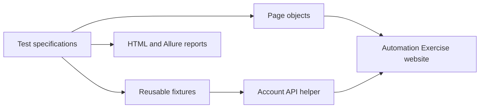

# Automation Exercise — Playwright Test Automation

[](https://github.com/intiser321/ui-automation-playwright-AutomationExercise/actions/workflows/playwright.yml)

An end-to-end UI automation framework for [Automation Exercise](https://automationexercise.com), built with Playwright and JavaScript. The project automates all 26 published test scenarios and demonstrates cross-browser testing, Page Object Model design, reusable fixtures, API-assisted test setup, automated cleanup, CI execution, and rich test reporting.

## Project highlights

- All 26 Automation Exercise test cases automated
- Cross-browser coverage on Chromium, Firefox, and WebKit
- 78 test executions in a complete three-browser run
- Page Object Model for reusable UI interactions
- Playwright fixtures for isolated account setup and cleanup
- API-assisted creation and deletion of test users
- Dynamic test data to prevent account collisions
- Failure artifacts captured through Playwright screenshots, videos, and traces
- Playwright HTML and Allure reporting
- Controlled parallel execution locally and in CI
- Built-in handling for common public-site ad, interstitial, and headed-browser interruptions
- Automated execution through GitHub Actions

## Test coverage

| Area | Test cases | Coverage |
| --- | ---: | --- |
| Authentication | 1–5 | Registration, valid and invalid login, logout, duplicate registration |
| Contact Us | 6 | Form submission and file upload |
| Test Cases page | 7 | Test cases page verification |
| Products | 8–9, 18–22 | Product details, search, categories, brands, reviews, recommended products |
| Subscription | 10–11 | Subscription from the home and cart pages |
| Cart | 12–13, 17 | Add products, quantities, and removal |
| Checkout | 14–16, 23–24 | Registration flows, login checkout, addresses, orders, and invoice download |
| Scrolling | 25–26 | Scroll-up button and manual scrolling behavior |

## Technology stack

| Tool | Purpose |
| --- | --- |
| [Playwright](https://playwright.dev/) | Browser automation and test runner |
| JavaScript | Test and framework implementation |
| Allure | Detailed test reporting |
| GitHub Actions | Continuous integration |
| Node.js | Project runtime and dependency management |

## Framework architecture



```text
.
├── api/                  API helpers for test setup and cleanup
├── fixtures/             Reusable Playwright fixtures
├── pages/                Page Object Model classes
├── test-data/            Test users, addresses, products, and upload files
├── tests/                Test specifications grouped by feature
├── .github/workflows/    GitHub Actions CI configuration
├── playwright.config.js  Browsers, reporters, retries, and test artifacts
└── package.json          Dependencies and project commands
```

## Getting started

### Prerequisites

- [Node.js](https://nodejs.org/) 22 or a compatible LTS version
- npm, included with Node.js
- Java 17 or newer only when generating or opening Allure reports locally
- Internet access, because the tests run against the public Automation Exercise website

### Installation

```bash
git clone https://github.com/intiser321/ui-automation-playwright-AutomationExercise.git
cd ui-automation-playwright-AutomationExercise
npm ci
npm run browsers:install
```

## Running the tests

### Easiest local option

Before running the Windows test runner, install [Node.js](https://nodejs.org/) 22 or a compatible LTS version. Node.js includes npm, which the runner needs before it can install dependencies or start Playwright.

To confirm Node.js and npm are ready, open Command Prompt or PowerShell and run:

```bash
node -v
npm -v
```

On Windows, double-click:

```text
run-tests.bat
```

The batch launcher runs `run-tests.cmd`, which performs a clean dependency install from `package-lock.json`, ensures Playwright browsers are available, runs the full cross-browser suite in headed mode, saves console output to `last-test-run.log`, and offers to open the HTML report when the run finishes.

If you share the project with someone else, share the GitHub repository or a zip without `node_modules`. Ask them to extract the zip before running `run-tests.bat`. The runner will install dependencies for their machine. Copying `node_modules` from another computer can cause every test to fail immediately because browser automation packages and cached binaries may not match the new machine.

If the runner says `npm was not found`, install Node.js from [nodejs.org](https://nodejs.org/), close and reopen the terminal or folder window, then run `run-tests.bat` again.

If the command window opens and closes too quickly to read, open Command Prompt in the extracted project folder and run:

```cmd
run-tests.bat
```

If you use VS Code, you can also run the suite without typing commands:

1. Open the Command Palette
2. Select `Tasks: Run Task`
3. Choose `Playwright: run all browsers`

### Command-line options

Run the complete suite on Chromium, Firefox, and WebKit:

```bash
npm test
```

Run the suite with a fixed parallel worker count:

```bash
npm run test:parallel
```

Run only the Chromium project for a faster first run:

```bash
npm run test:chromium
```

Run tests with a visible browser:

```bash
npm run test:headed
```

The headed run uses three workers by default so Chromium, Firefox, and WebKit can run efficiently without overwhelming the public demo website.

List the discovered tests without executing them:

```bash
npm run test:list
```

> **Windows PowerShell:** If script execution policy blocks `npm.ps1`, use `npm.cmd` instead, for example `npm.cmd run test:chromium`, or run the commands from Command Prompt.

### If every test fails immediately

If the HTML report shows all tests failing in only a few seconds, it usually means the environment setup failed before the UI steps started. Run these from the project root, or just double-click `run-tests.cmd`:

```bash
npm ci
npm run browsers:install
npm run test:headed
```

Also make sure Node.js is installed, the machine has internet access, and the project was not copied with an old `node_modules` folder.

## Test reports and debugging

### Playwright HTML report

The HTML report is generated in `playwright-report/` after a test run. Open it with:

```bash
npm run report
```

### Allure report

Raw Allure results are written to `allure-results/`. Generate and open the report with:

```bash
npm run allure:generate
npm run allure:open
```

On failure, the framework captures diagnostic artifacts according to the Playwright configuration:

- Screenshot on failure
- Video retained on failure where enabled for the browser project
- Trace captured on the first retry

These files are available in the test results and reports, making failures easier to reproduce and investigate.

## Continuous integration

The [GitHub Actions workflow](https://github.com/intiser321/ui-automation-playwright-AutomationExercise/actions/workflows/playwright.yml) runs reliable project validation on pushes and pull requests targeting `main` or `master`.

The push/PR validation job:

1. Installs dependencies from the lockfile
2. Loads the Playwright configuration
3. Lists all 78 discovered tests across Chromium, Firefox, and WebKit

The full live E2E suite is available as a manual GitHub Actions run through `workflow_dispatch`. That job:

1. Runs in the official Playwright container
2. Installs dependencies from the lockfile
3. Executes the complete cross-browser suite in controlled parallel mode
4. Generates the Allure report
5. Uploads Playwright and Allure reports as downloadable workflow artifacts

The manual live E2E job uses three workers by default and retries failed tests twice to balance speed with stability when exercising the external demo website. The worker count can be changed from the workflow input.

## External site limitation

Automation Exercise is a third-party public practice website. It can show advertisements, Google vignette/interstitial pages, temporary request verification screens, or occasional server errors. The framework includes ad-domain blocking, overlay dismissal, navigation waits, headed-browser interaction safeguards, and limited retry logic to reduce this noise during local runs.

Even with those safeguards, GitHub-hosted runners may occasionally be blocked or rate-limited by the external website. For that reason, push/PR CI validates the framework and test discovery, while the full live browser suite is kept as an on-demand run with downloadable reports.

## Test design

- Tests are grouped by business feature rather than page implementation.
- Page objects centralize locators, actions, and reusable assertions.
- Fixtures provide fresh users and guarantee cleanup after each applicable test.
- Account setup uses the website API where appropriate, keeping UI tests focused on the behavior under test.
- Generated email addresses keep tests independent and safe for parallel execution.

## Author

Created by [Intiser](https://github.com/intiser321) as a software quality assurance and test automation portfolio project.
